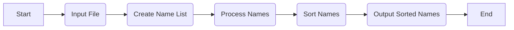

# Welcome to Name Sorter

---

This is a Java command-line application that reads a list of names from a text file, sorts them alphabetically by last
name, and writes the sorted list to another text file.

## Getting Started

---

### Prerequisites

---

To run this app, you need to have Java 8 or higher installed on your machine.

### Installation

---

1. Download the source code for the app and extract it to a directory.

2. Compile the code by running the following command:

`javac -d bin -cp src src/main/java/com/globalx/namesorter/NameSorterApp.java`

This will compile the `NameSorterApp` class and place the compiled `.class` files in a directory called `bin`.

### Usage

---

To run the app, follow these steps:

1. Place your input file (e.g. `unsorted-names-list.txt`) in the `root` directory.

2. There are two types of synchronization and they can complement each other:

- **using Java**
    - Run the app by running the following command:

> `
java -cp bin com.globalx.namesorter.NameSorter unsorted-names-list.txt
`

- **Using Gradle**
    - Run the app by running the following command:

> `
gradle run --args=unsorted-names-list.txt   
`


This will run the `NameSorter` class with the input file as the first argument and the output file as the second
argument. The sorted names will be written to the output file.

3. Check the output file (e.g. `sorted-names-list.txt`) in the `root` directory to verify that the names have been
   sorted.

### Testing

---

To run the unit tests for the app, you can use a build tool like Maven or Gradle. Alternatively, you can compile and run
the tests manually using the following commands:

```
javac -cp "src:test:junit-4.13.2.jar" -d bin/test test/name/*.java

java -cp "bin:test:junit-4.13.2.jar:hamcrest-core-1.3.jar" org.junit.runner.JUnitCore name.FirstNameComparatorTest name.LastNameComparatorTest name.NameTest name.NameSorterTest
```

---

## UML Diagram

Here's a UML diagram of the project's classes and their relationships:

```mermaid
sequenceDiagram
    participant User
    participant NameSorter
    User->>+NameSorter: sortNames(inputFile, outputFile)
    NameSorter->>-Name: new Name(fullName)
    loop for each name in inputFile
        NameSorter->>-Name: getFirstName()
        NameSorter->>-Name: getLastName()
        NameSorter->>-Name: getGivenNames()
        NameSorter->>+List<Name>: add(name)
    end
    NameSorter->>+List<Name>: sort()
    loop for each name in List<Name>
        NameSorter->>-Name: getFirstName()
        NameSorter->>-Name: getLastName()
        NameSorter->>-Name: getGivenNames()
        NameSorter->>+FileWriter: writeToFile(name)
    end
    NameSorter-->>-User: sorted list of names
```



---

## Built With

* Java
* JUnit

## Authors

* Maduka Jayawardana

## License

This project is licensed under the MIT License - see the [LICENSE.md](LICENSE.md) file for details.

